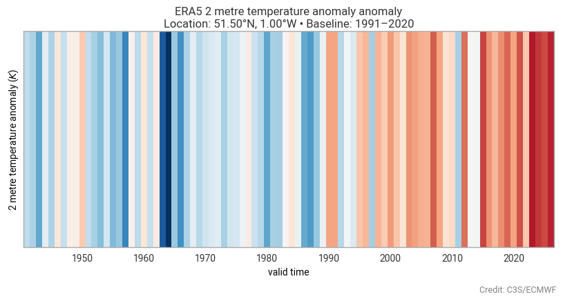

Why earthkit-transforms?
==========================

**earthkit-transforms** provides a library of quality assured methods for transforming and analyzing climate
and meteorology data.
There is a focus on a clear and simplified API to complex transformations, whilst ensuring that
accuracy and performance are not compromised. The methods are designed to be intuitive and self-explanatory
to encourage their use and to make them accessible to a wide range of users, from beginners to experts.

Key features include:

⚙️ **Concise, high-level API** -
Compute complex transformations with simple, intuitive methods.

🧠 **Intelligent data handling** -
Data format and structure is handled automatically, so you can focus on the analysis.

⚡ **Performance and scalability** -
Compatible with both CPU and GPU, and with data objects that are lazily loaded or in-memory, ensuring efficient processing of large datasets.

🎨 **Plug-and-play with earthkit-plots** -
The results of transformations are designed to be easily visualised with the companion library, earthkit-plots, with methods that return plot-ready objects.

Image created with the :doc:`../tutorials/climatology/01-era5-climatology` tutorial notebook.